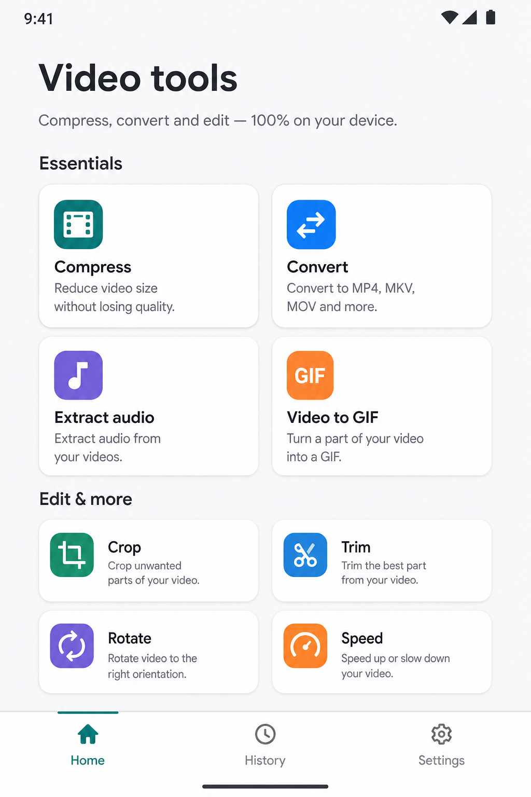
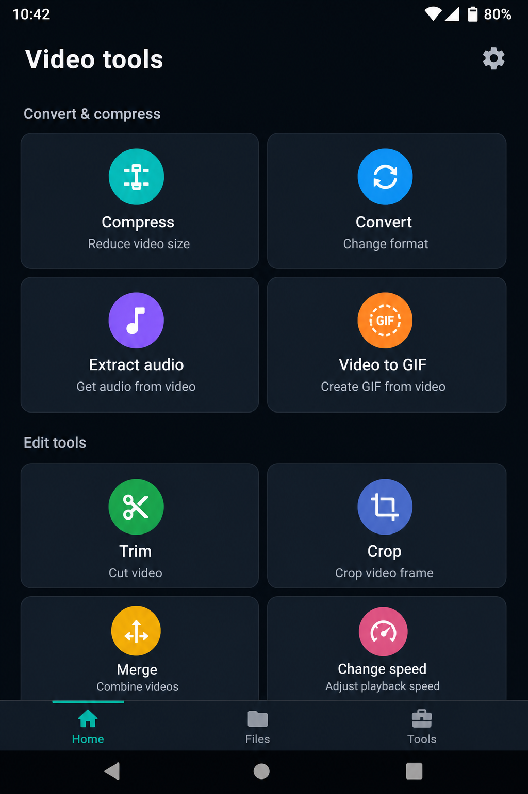
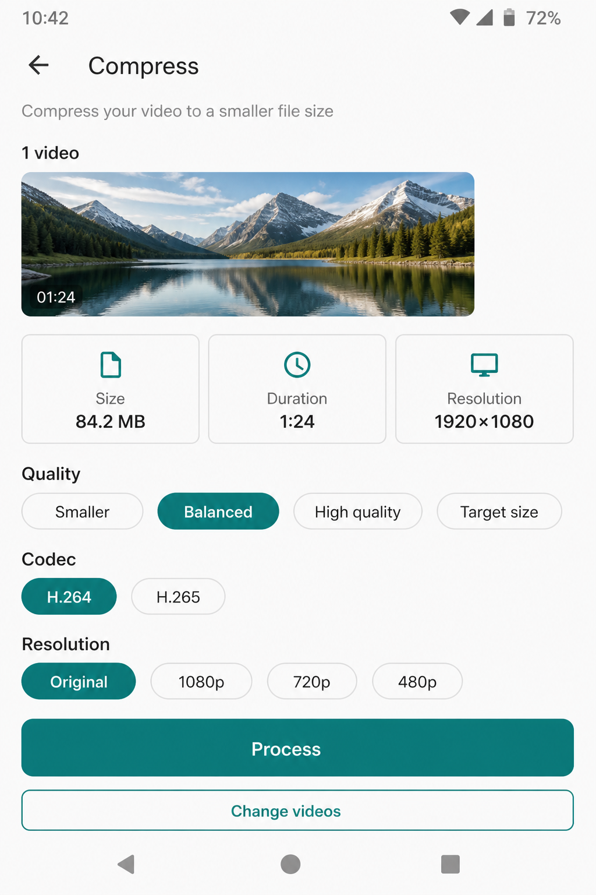
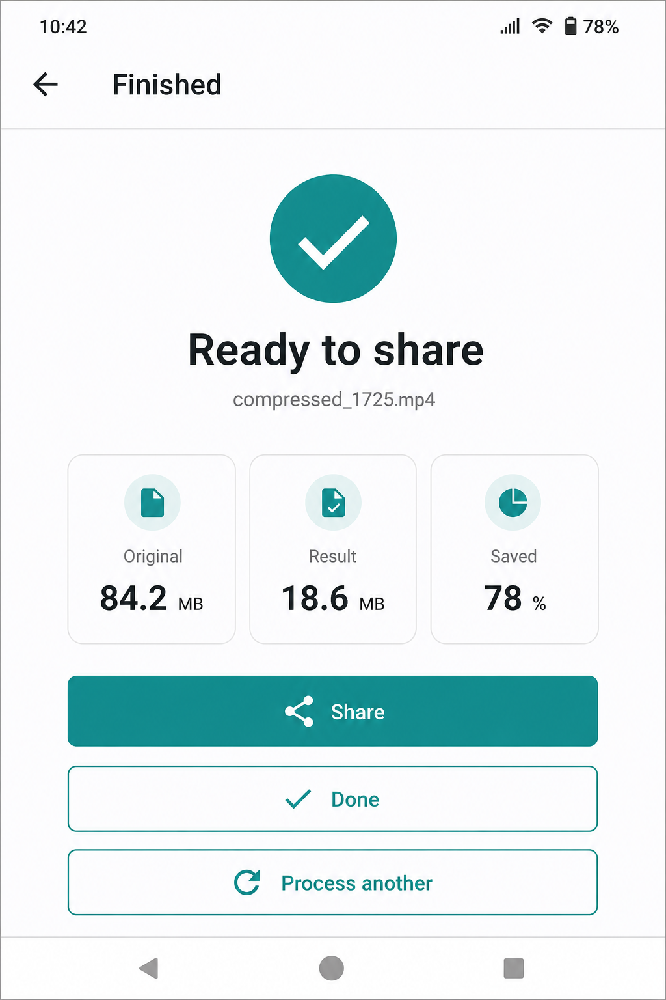
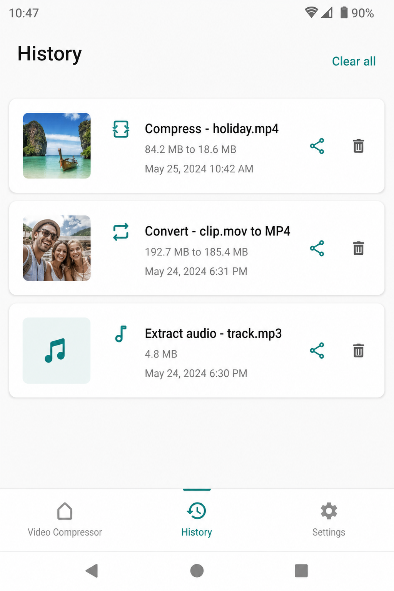
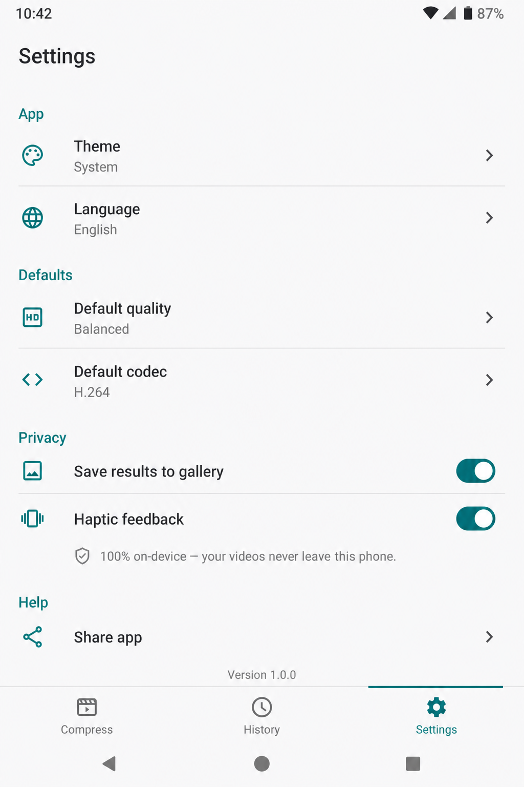

# Video Compressor

On-device Android app to **compress, convert, and edit videos** — no account, no uploads. Built with **Clean Architecture**, **Jetpack Compose**, and a modular Gradle setup.

Inspired by the Play Store listing for [Video Compressor - Convert](https://play.google.com/store/apps/details?id=com.durusoft.videocompressor.size.reducer.converter&hl=en).

| | |
| --- | --- |
| **Application ID (ASO)** | `com.videocompress.size.reducer.converter` |
| **Default language** | English |
| **Locales** | 30 Play-supported languages |
| **Min / target SDK** | 26 / 36 |
| **UI** | Material 3, light + dark + system |
| **Release** | R8 / ProGuard minify + resource shrink |

## Screenshots

<p>
  
  
  
</p>
<p>
  
  
  
</p>

## Features

Everything runs locally with FFmpeg (hardware-friendly software encode via `libx264` / `libx265`).

| Tool | What it does |
| --- | --- |
| **Compress** | Quality presets, optional target size (MB), H.264 / H.265, resolution cap |
| **Convert** | MP4, MOV, MKV, WEBM, AVI, 3GP |
| **Extract audio** | MP3, M4A, AAC, WAV |
| **Video ↔ GIF** | FPS / width for GIF; GIF to MP4 |
| **Crop** | Free, 1:1, 16:9, 9:16, 4:3 |
| **Trim** | Start / end range |
| **Rotate & flip** | 90°, 180°, horizontal / vertical flip |
| **Speed** | 0.25x – 3x with chained `atempo` |
| **Volume** | Gain, mute, or strip audio |
| **Reverse / loop / merge** | Reverse clip, repeat, concat multiple files |
| **Social size** | Reels, Post, Story, YouTube, TikTok, WhatsApp, X, Facebook |
| **Batch** | Multiple files for compress / convert / merge |
| **History** | Local Room list with share / delete |
| **Share sheet / Open with** | Incoming `video/*` intents |

Privacy copy in Settings: videos never leave the phone.

## Architecture

```
app/                    Navigation, Hilt Application, theme host
core/common             Enums, formatters (no Android UI)
core/domain             Models, repository contracts, use cases
core/data               Room, DataStore, MediaStore, URI copy
core/video              FFmpeg command builder + session runner
core/ui                 Material 3 theme, chips, cards, locale helper
core/resources          strings.xml × 30 locales
feature/home            Tool grid
feature/editor          Pick → options → process → result
feature/history         Past jobs
feature/settings        Theme, language, defaults
```

**Dependency rule:** `feature → domain ← data`. UI never talks to FFmpeg or Room directly.

Processing flow:

1. Photo Picker / share intent → `ResolveVideoUseCase` (MediaMetadataRetriever)
2. Content URI copied to cache (FFmpeg needs a real path)
3. `FfmpegCommandBuilder` builds the tool-specific command
4. Progress via FFmpeg statistics callback
5. Output written to `Movies/VideoCompressor` (or Music / Pictures for audio / GIF)
6. `HistoryRepository` stores the job

## Languages (30)

English (default) plus Arabic, Bengali, Chinese (Simplified), Czech, Dutch, Filipino, French, German, Greek, Hebrew, Hindi, Hungarian, Indonesian, Italian, Japanese, Korean, Malay, Persian, Polish, Portuguese, Romanian, Russian, Spanish, Swedish, Thai, Turkish, Ukrainian, Urdu, Vietnamese.

Per-app language uses AndroidX `AppCompatDelegate` + `localeConfig`.

## Build & run

**Requirements:** JDK 17 (Android Studio JBR), Android SDK 36, Gradle 8.11.1 (wrapper included).

```bash
export JAVA_HOME="/Applications/Android Studio.app/Contents/jbr/Contents/Home"
export ANDROID_HOME="$HOME/Library/Android/sdk"

# Debug
./gradlew :app:assembleDebug

# Signed release (R8 + resource shrinking)
./gradlew :app:assembleRelease
```

Release APK:

```
dist/VideoCompressor-1.0.0-release.apk
app/build/outputs/apk/release/app-release.apk
```

Create `keystore.properties` in the project root (not committed):

```properties
storeFile=release.keystore
storePassword=...
keyAlias=videocompressor
keyPassword=...
```

Install on a device:

```bash
adb install -r dist/VideoCompressor-1.0.0-release.apk
```

## ProGuard / R8

Release builds enable `isMinifyEnabled` and `isShrinkResources`. Keep rules live in `app/proguard-rules.pro` for FFmpegKit, Hilt, Room, Media3, and domain models.

## Tech stack

- Kotlin 2.0, AGP 8.7, Compose BOM 2024.12
- Hilt, Room, DataStore
- Coil (video frame thumbnails)
- [FFmpegKit maintained](https://github.com/ffmpegkit-maintained/ffmpeg) `ffmpeg-kit-full-gpl` 8.1.7
- Material 3 navigation (Home / History / Settings)

## Module graph

```
app
 ├─ feature:home, editor, history, settings
 └─ core:ui, data, video, domain, common, resources
        data → video + domain
        video → domain
        feature → domain + ui + resources
```

## License

App source is MIT. FFmpeg / x264 / x265 are covered by their own LGPL / GPL licenses — see [FFmpeg legal](https://www.ffmpeg.org/legal.html).
